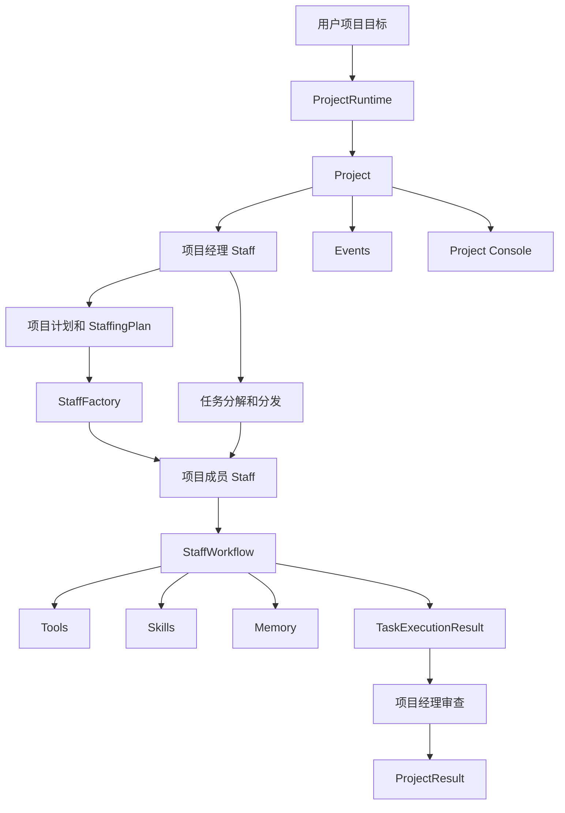
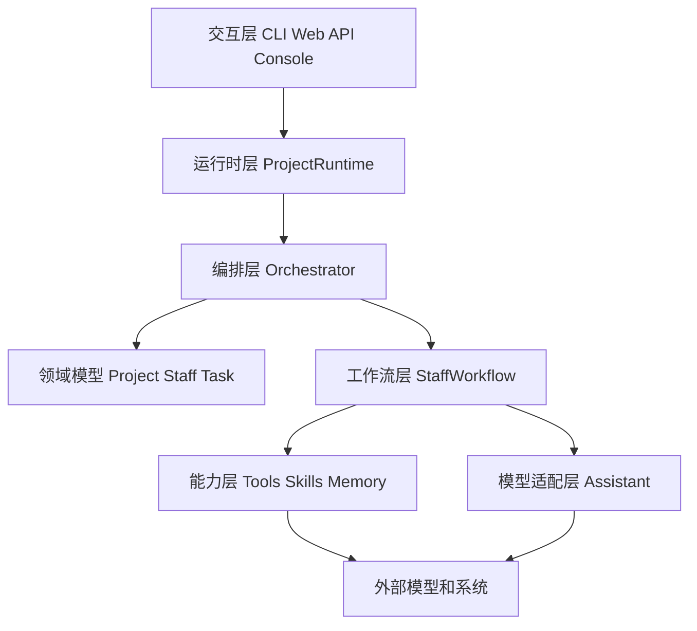
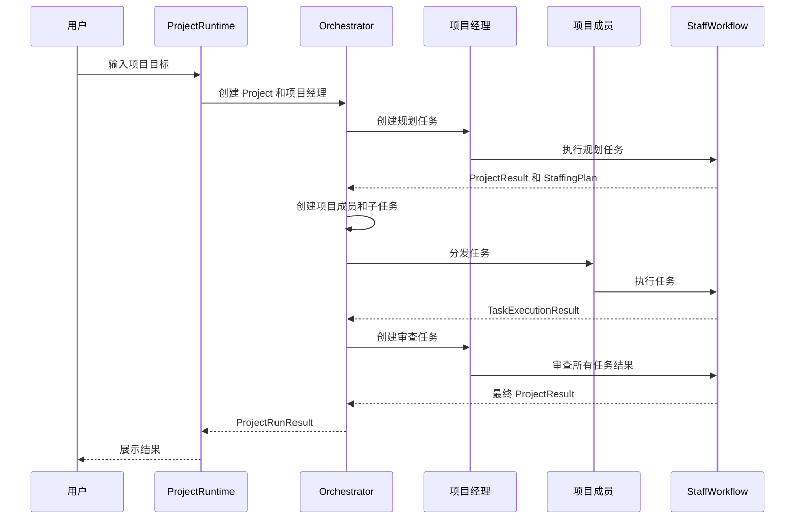
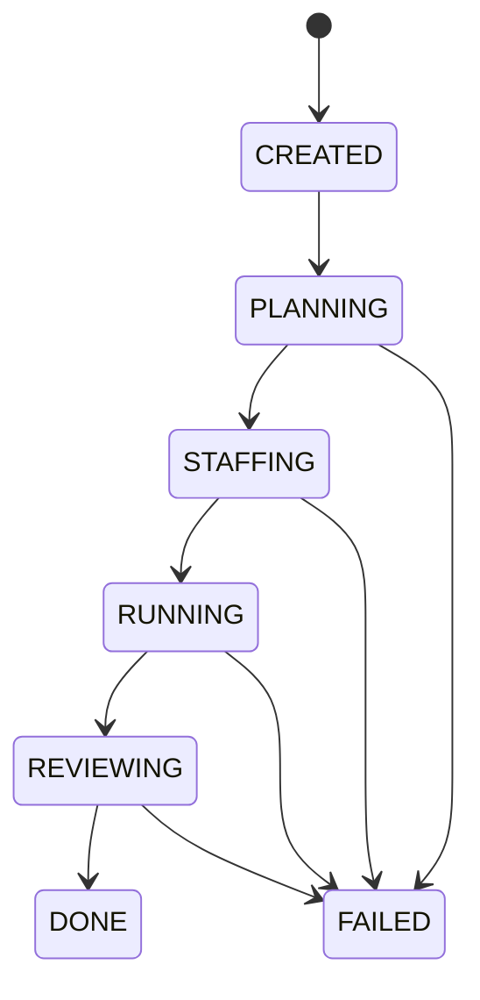
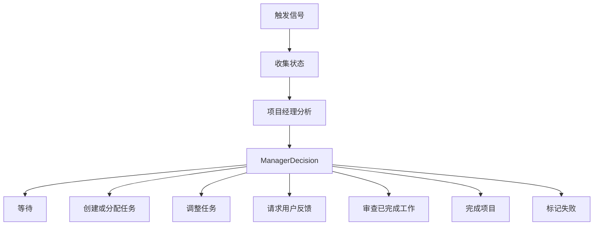
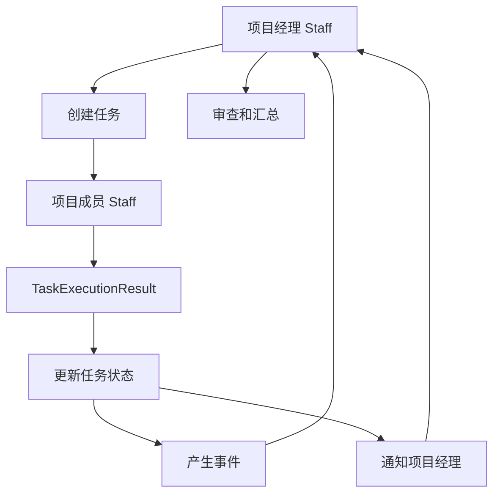
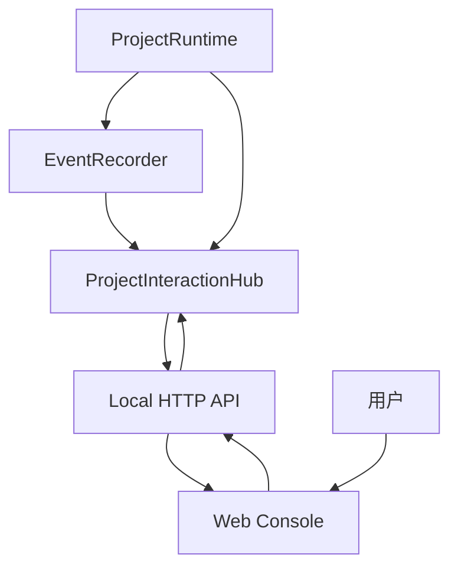

# Lego Agent 框架重新审视设计文档

## 1. 设计结论

`lego_agent` 应定位为一个“项目型多智能体执行框架”，而不是一个简单的聊天机器人框架，也不是一个固定组织架构模拟器。

框架的核心输入是一个项目目标。系统先创建项目，再创建项目经理。项目经理负责理解目标、制定计划、招募项目成员、分发任务、跟踪进度、审查结果，并最终交付项目结果。

所有项目成员统一抽象为 `Staff`。项目经理、开发人员、测试人员、研究人员、审查人员都不是不同的数据模型，而是同一个 `Staff` 模型在职责、能力、任务、助手配置和上下文上的不同组合。

当前最重要的设计取舍是：

1. `Project` 是唯一顶层运行时聚合。
2. `Staff` 是唯一项目成员抽象。
3. `Task` 是 staff 之间协作的最小工作单元。
4. staff 之间不直接调用彼此。
5. staff 通过任务状态、事件、消息、项目上下文进行协作。
6. workflow 是 staff 执行任务的统一过程。
7. tools、skills、memory、frontend 都是 workflow 周边能力，不应该反向污染核心模型。
8. ReAct 是一种 workflow 执行风格，不应该成为整个框架的唯一架构。

## 2. 当前混乱的根源

当前设计逐步演进出了多个方向：

- 项目化运行时。
- 动态 staff 创建。
- 多 staff 协作。
- 迭代 workflow。
- tool-call loop。
- tool registry。
- skill 设计。
- memory 设计。
- ReAct。
- 前端交互层。
- 日志和事件。

这些方向本身都合理，但它们属于不同层级。如果不分层，就会出现两个问题：

1. 抽象边界混在一起。
   例如把 ReAct、tool、skill、staff、orchestrator 放在同一个设计层讨论，会导致每个概念都像核心概念。

2. 开发顺序混在一起。
   例如前端交互、异步执行、真实 skill runtime、持久化存储都很重要，但它们不应该阻塞当前单机闭环。

所以需要重新定义一套更稳定的分层。

## 3. 目标架构

### 3.1 总体结构



### 3.2 分层架构



每一层的职责必须清晰：

- 交互层负责让用户看到项目状态、提交反馈、发出控制命令。
- 运行时层负责加载配置、创建项目、创建项目经理、选择编排器。
- 编排层负责推进项目阶段、创建 staff、分发任务、等待结果、触发审查。
- 领域模型负责表达项目、人员、任务、事件、消息、结果。
- 工作流层负责一个 staff 如何完成一个任务。
- 能力层负责工具调用、技能方法、记忆检索。
- 模型适配层负责和 OpenAI 兼容接口通信。

## 4. 核心领域模型

### 4.1 Project

`Project` 是唯一顶层运行时对象。

它应该回答这些问题：

- 项目目标是什么。
- 当前项目状态是什么。
- 项目经理是谁。
- 项目成员有哪些。
- 项目任务有哪些。
- 项目最终结果是什么。
- 项目运行过程中发生了什么事件。

`Project` 不应该直接知道如何调用 LLM，也不应该直接执行工具。

### 4.2 Staff

`Staff` 是统一项目成员抽象。

一个 staff 包含：

- 身份信息：`id`、`name`、`role`、`title`。
- 职责：这个 staff 应该负责什么。
- 能力：这个 staff 能做什么。
- AI 助手：这个 staff 使用哪个模型和配置。
- 上下级关系：`manager_id`、`report_ids`。
- 当前工作状态：空闲、工作中、阻塞、离线。
- 当前任务：`current_task_id`。

重要原则：

- 项目经理也是 staff。
- 新招募成员也是 staff。
- 不要为不同角色创建不同 class。
- 差异来自配置和上下文，不来自模型继承。

### 4.3 Task

`Task` 是 staff 协作的核心媒介。

项目经理不应该直接调用某个 staff 的方法，而是创建任务并分配给 staff。staff 完成任务后更新任务状态，产出 `TaskExecutionResult`，并通过事件或消息通知项目经理。

任务状态是协作的事实来源。事件和消息是通知，不是事实来源。

### 4.4 Result

结果分两类：

- `TaskExecutionResult`：普通 staff 完成单个任务后的结构化输出。
- `ProjectResult`：项目经理对项目整体计划或最终交付的结构化输出。

这两个结果不应混用。普通 staff 不应该输出项目最终结论，项目经理才负责最终项目结果。

## 5. 运行时主流程

### 5.1 当前建议的单机闭环



### 5.2 项目状态流转



当前第一目标应该是保证这条单机闭环稳定，而不是立即进入异步、分布式或复杂前端。

### 5.3 当前触发方式的限制

当前 `project_manager_with_staff` 更接近“阶段式单轮编排”：

```text
项目经理规划一次
  -> 创建 staff 和 child tasks
  -> orchestrator 触发 staff 执行
  -> 所有 child tasks 完成
  -> 项目经理 review 一次
  -> 项目结束
```

这条链路能验证项目化闭环，但还不是一个真实项目经理持续管理项目的模式。当前项目经理不会在执行过程中定期集合分析子 staff 的任务状态，也不会根据中间状态动态调整计划。

更合理的下一层抽象不是简单“心跳定时器”，而是 `ManagerControlLoop`。

心跳只是一种触发方式，真正重要的是项目经理每一轮如何感知状态并做决策。

### 5.4 Manager Control Loop

`ManagerControlLoop` 是项目经理的持续控制循环。

它每一轮应该完成：

1. 收集项目状态。
2. 收集任务状态。
3. 收集 staff 状态。
4. 收集事件和消息摘要。
5. 分析当前项目是否需要干预。
6. 输出结构化决策。
7. 由 orchestrator 执行决策。

建议控制循环：



触发信号可以分三类：

1. 事件触发。
   - task completed。
   - task failed。
   - user feedback arrived。
   - tool failed。

2. 心跳触发。
   - 每隔固定时间检查一次。
   - 适合长任务和防遗漏。

3. 混合触发。
   - 事件立即触发。
   - 心跳作为兜底。

第一版建议实现同步版控制循环，不要直接做后台定时器：

```text
orchestrator loop
  -> collect snapshot
  -> PM decides next action
  -> orchestrator applies action
  -> repeat until DONE, FAILED, WAIT, or ASK_USER
```

`WAIT` 和 `ASK_USER` 在同步版本中是停止点，因为当前没有后台 worker 或前端输入通道可以立即改变状态。后续引入事件触发或心跳触发后，可以从这些等待状态恢复下一轮控制循环。

建议后续模型：

```python
class ManagerDecision(BaseModel):
    action: str
    rationale: str
    new_tasks: list[TaskPlan] = []
    task_updates: list[TaskUpdate] = []
    project_status: ProjectStatus | None = None
```

`action` 第一版可以控制在：

- `wait`
- `assign_task`
- `review`
- `finish`
- `fail`
- `ask_user`

不要让项目经理直接修改任意对象。项目经理输出决策，orchestrator 根据决策执行允许的动作。

第一版快照应该包含未读 staff 消息摘要：

```python
class StaffMessageSnapshot(BaseModel):
    message_id: str
    sender_id: str
    recipient_id: str
    type: StaffMessageType
    task_id: str | None
    content_summary: str
```

当未读消息中出现 `question`、`help_requested` 或 `blocker_reported` 时，确定性控制循环可以先产出 `ask_user` 决策，并由 orchestrator 记录 `project_user_input_requested` 事件。后续可以把这个决策接入前端或 CLI 交互。

### 5.5 当前执行模型：串行 worker

当前 worker staff 的任务执行是串行的：

```text
for task in child_tasks:
    workflow.run(project, staff, task)
    completion_handler.complete(...)
```

也就是说，一个 staff 的 work 没完成，下一个 staff 不会开始。

这是当前阶段可以接受的，因为 V2A 的目标是先验证：

- staff 创建。
- task 分发。
- task 状态更新。
- 事件记录。
- manager review。

但它不是最终形态。真实项目中多个 staff 应该可以并发工作，项目经理通过控制循环定期感知状态，而不是等待所有 staff 串行完成。

因此更合理的演进顺序是：

```text
1. 同步串行执行，跑通数据闭环。
2. 同步 ManagerControlLoop，跑通 PM 多轮决策。
3. asyncio 并发执行 staff work。
4. 事件触发 + 心跳触发 PM 控制循环。
5. 分布式 worker 和持久化队列。
```

## 6. StaffWorkflow 抽象

### 6.1 Workflow 的职责

`StaffWorkflow` 只回答一个问题：

一个 staff 拿到一个 task 后，如何完成它。

统一接口应保持简单：

```python
run(project, staff, task) -> WorkResult
```

workflow 内部可以包含：

- 构建上下文。
- 检索记忆。
- 选择 skill。
- 选择 tool。
- 构造 prompt。
- 调用 assistant。
- 执行 tool call。
- 解析结构化输出。
- 重试或失败。
- 更新任务结果。
- 记录事件。

### 6.2 Workflow 类型

建议保留两种基础 workflow：

1. `SinglePassStaffWorkflow`
   - 一次调用模型。
   - 简单、稳定、适合测试和基础任务。

2. `IterativeStaffWorkflow`
   - 多轮调用模型。
   - 支持结构化输出重试。
   - 支持 tool call loop。
   - 支持未来的 ReAct 风格。

不建议马上增加大量 workflow class。ReAct 不应该先做成独立大框架，而应该先作为 `IterativeStaffWorkflow` 的一种执行模式。

## 7. ReAct 的位置

ReAct 是一种“推理、行动、观察、继续推理”的任务执行模式。

它适合解决这些问题：

- staff 需要根据工具结果决定下一步。
- 任务无法一次模型调用完成。
- 需要可观察的执行步骤。
- 需要前端展示当前正在做什么。

但是 ReAct 不应该成为系统的顶层设计。顶层设计仍然是项目、staff、任务、编排。

建议配置方式：

```json
{
  "workflow": {
    "type": "iterative",
    "reasoning_style": "react",
    "tools": "builtin",
    "max_steps": 8,
    "max_tool_calls": 5
  }
}
```

建议 ReAct 只记录可展示摘要，不要求模型暴露完整思考链：

```python
class WorkflowStepTrace(BaseModel):
    step_number: int
    phase: str
    summary: str
    tool_calls: list[ToolCall]
    tool_results: list[ToolResult]
```

前端和日志展示的是：

- 当前步骤。
- 为什么需要工具的简短说明。
- 调用了什么工具。
- 工具返回了什么摘要。
- 最终产出了什么。

不要依赖完整 chain-of-thought。

## 8. Tools、Skills、Memory 的边界

### 8.1 Tools

Tool 是外部动作。

典型 tool：

- 读取项目文件。
- 写入项目文件。
- 搜索文档。
- 执行测试。
- 调用 HTTP API。
- 查询数据库。

Tool 必须具备：

- 明确名称。
- 明确参数 schema。
- 明确返回 `ToolResult`。
- 明确权限边界。
- 清晰日志。
- 不泄露密钥。

Tool 应通过 `ToolRegistry` 注册，由 `ToolManager` 调用。workflow 不直接依赖具体 tool class。

### 8.2 Skills

Skill 是可复用的方法或工作套路，不一定是外部动作。

例如：

- 需求分析方法。
- 代码审查方法。
- 测试设计方法。
- 项目拆解方法。

第一阶段 skill 可以只是 prompt instruction。后续再考虑 skill runtime。

不要把 skill 和 tool 混为一谈：

- tool 更像“执行一个动作”。
- skill 更像“指导如何完成一类工作”。

### 8.3 Memory

Memory 是跨任务或跨项目的上下文来源。

第一阶段只保留接口，不急于实现复杂向量数据库。

建议演进顺序：

1. 当前任务上下文。
2. 当前项目内历史任务结果。
3. 当前项目内事件摘要。
4. 跨项目记忆。
5. 向量检索。

## 9. Staff 之间如何协作

staff 之间不直接调用。

正确协作方式：



项目经理感知进展的方式：

- 查询 `TaskStore`。
- 接收 `MessageBus` 消息。
- 读取项目事件。
- 查看 staff 状态。

其中 `TaskStore` 是事实来源。

### 9.1 Staff 消息沟通

staff 之间应该能够沟通，但沟通必须通过 `MessageBus`，不能直接调用对方对象的方法。

消息适合表达：

- 提问：`question`
- 请求帮助：`help_requested`
- 报告阻塞：`blocker_reported`
- 状态更新：`status_update`
- 任务通知：`task_assigned`、`task_completed`、`task_failed`

消息的作用是通知和协作，不是直接改变事实状态。比如一个 staff 报告阻塞后，项目经理或 orchestrator 可以根据消息决定是否修改任务状态，但消息本身不应该直接把任务改成 failed。

当普通 staff 的 `TaskExecutionResult.blockers` 非空时，任务完成处理器应该自动向项目经理发送 `blocker_reported` 消息。这样 staff 不需要额外调用一个通信接口，也能让项目经理在下一轮 `ManagerControlLoop` 中看到阻塞。

推荐边界：

```text
Staff
  -> StaffCommunicationService
  -> MessageBus
  -> StaffMessage
  -> ProjectEvent
```

`StaffCommunicationService` 负责校验收发双方是否属于同一个项目，记录事件，并避免日志泄露消息正文。`MessageBus` 负责投递和收件箱查询。

## 10. 前端交互层的位置

前端不应该直接控制 workflow 或 staff。

最小侵入设计是加入一个中间交互层：



前端第一版只需要做到：

- 展示项目状态。
- 展示 staff 列表。
- 展示任务列表。
- 展示事件流。
- 允许用户提交反馈。

不要一开始就做复杂的人机协同控制。先让用户“看得见”，再让用户“能介入”。

## 11. 配置边界

配置应该解决三类问题：

1. 运行时选择。
   - 使用哪个 orchestrator。
   - 使用哪个 workflow。
   - 是否启用动态 staff。

2. 模型配置。
   - model。
   - api_key。
   - base_url。
   - timeout。
   - token_limit。
   - reasoning_effort。
   - stream。

3. 能力配置。
   - 启用哪些 tools。
   - 启用哪些 skills。
   - workspace_root。
   - 后续 memory backend。

不要把业务任务写死在配置里。配置提供能力和策略，具体项目任务由项目经理根据目标生成。

## 12. 推荐的近期开发顺序

当前代码已经完成了不少基础能力。下一步不要继续横向扩展太多概念，建议按下面顺序收敛：

### 阶段 A：稳定单机项目闭环

目标：

- 项目经理规划。
- 动态创建 staff。
- 分发任务。
- staff 执行任务。
- 项目经理审查。
- 项目 DONE 或 FAILED。

验收：

- dry-run 稳定。
- 真实 LLM 简单任务稳定。
- 事件能解释完整过程。
- 测试覆盖成功、失败、结构化输出失败。

### 阶段 B：引入同步 Manager Control Loop

目标：

- 明确当前项目经理不是单轮执行器，而是项目控制者。
- 增加项目快照收集。
- 增加 `ManagerDecision`。
- orchestrator 根据 decision 执行动作。
- 第一版不做后台心跳，只做同步循环。

验收：

- 项目经理可以基于任务状态做多轮决策。
- 可以选择等待、审查、完成、失败、请求用户反馈。
- 所有决策都有事件记录。
- 不让 manager 直接修改领域对象。

### 阶段 C：稳定工具执行

目标：

- ToolRegistry 稳定。
- 内置工具逐步增加。
- 工具权限清晰。
- 工具结果能进入后续模型上下文。

优先工具：

- `read_project_file`
- `list_project_files`
- `write_project_file`
- `run_shell_command`
- `run_pytest`

注意：写文件和执行命令必须有清晰边界和日志。

### 阶段 D：引入可观察的 ReAct 模式

目标：

- 在 `IterativeStaffWorkflow` 中加入 `reasoning_style`。
- 支持 `react`。
- 记录 `WorkflowStepTrace`。
- 前端和日志可展示每一步摘要。

不要暴露完整思考链。

### 阶段 E：实现 Project Console 最小版

目标：

- 本地 API。
- 静态页面。
- 展示项目、staff、task、event。
- 用户可提交 feedback。

第一版不做复杂实时控制。

### 阶段 F：异步和持久化

目标：

- asyncio 并发执行 staff 任务。
- 事件触发和心跳触发 manager control loop。
- TaskStore 可替换。
- EventStore 可持久化。
- MessageBus 可替换。

这一阶段应在单机闭环和可观察性稳定之后再做。

## 13. 明确暂时不做的事

为了避免继续混乱，近期明确不做：

- 不做复杂组织架构系统。
- 不做多层 manager 树。
- 不做分布式 worker。
- 不做复杂权限系统。
- 不做长期记忆向量库。
- 不做完整前端协同控制台。
- 不把 ReAct 升级成顶层架构。
- 不为每种角色创建单独的 Python class。

这些都可以未来做，但不应该进入当前主线。

## 14. 工程原则

后续开发必须继续遵守：

1. 注释清晰，初学者能读懂。
2. 代码符合 SOLID。
3. 代码即文档。
4. 日志和事件可解释运行过程。
5. 不记录密钥和敏感数据。
6. 每完成一个任务都回头检查设计边界。

额外补充：

- 新概念必须先说明属于哪一层。
- 新能力必须说明是否影响核心领域模型。
- 新功能必须说明为什么现在做，而不是以后做。
- 能通过配置和注册表扩展的，不要硬编码到 orchestrator 或 workflow。

## 15. 最终判断

当前框架方向是正确的，但需要从“功能堆叠”回到“核心闭环”。

稳定的主线应该是：

```text
Project
  -> ProjectManager Staff
  -> StaffingPlan
  -> Staff
  -> Task
  -> StaffWorkflow
  -> TaskExecutionResult
  -> Manager Review
  -> ProjectResult
```

所有其他能力都应该围绕这条主线服务：

- tools 帮 staff 做事。
- skills 指导 staff 怎么做事。
- memory 给 staff 补上下文。
- ReAct 让 workflow 多步可观察。
- frontend 让用户看见和介入。
- async 让多个 staff 并发。
- persistence 让项目长期存在。

只要这条主线不乱，框架就不会乱。
