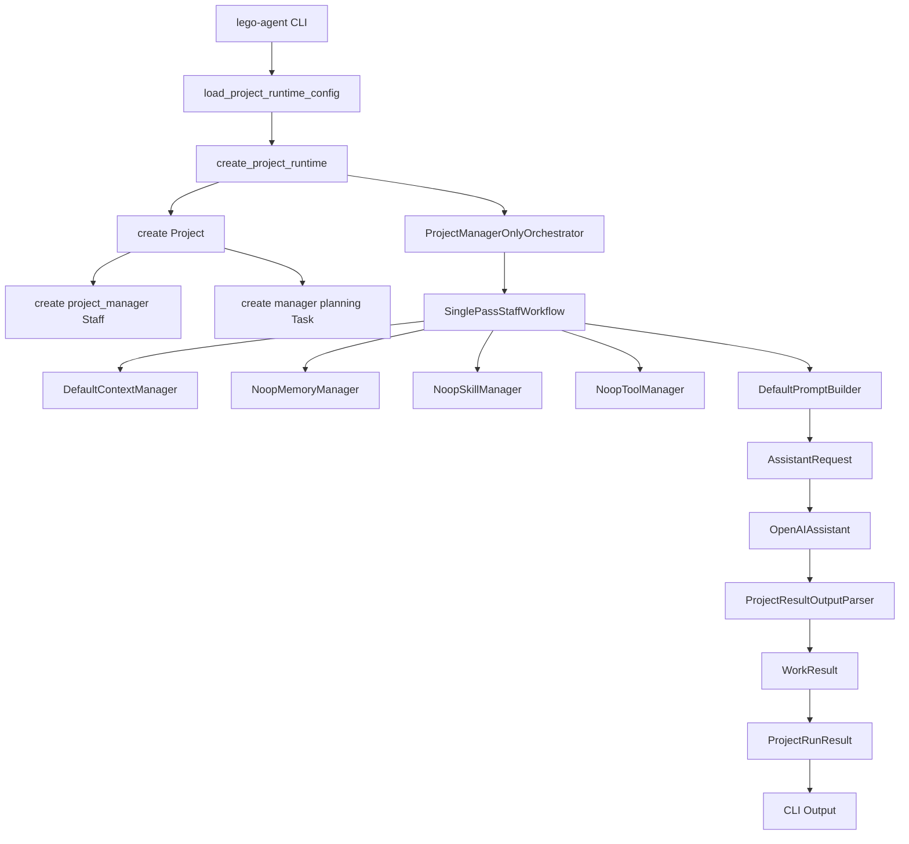

# CLI Call Flow

This document explains what happens after running:

```bash
lego-agent project run
```

The project goal and output preferences can come from
`configs/project_runtime.json`. The CLI can still override them:

```bash
lego-agent project run --config configs/project_runtime.json "Build a configurable agent framework"
```

## Summary

The CLI loads runtime config, resolves a project goal from the command line or
`project.goal`, creates a `Project`, creates one primary project manager
`Staff`, creates one planning `Task`, runs the unified `SinglePassStaffWorkflow`,
parses a structured `ProjectResult`, and prints a `ProjectRunResult`.

## Full Call Chain

```text
lego-agent
  -> lego_agent.cli.main
    -> load_project_runtime_config
    -> create_project_runtime
      -> register_defaults
      -> register_builtin_factories
      -> SinglePassStaffWorkflow
      -> ProjectManagerOnlyOrchestrator
    -> runtime.run(goal)
      -> create_project
        -> Project
        -> Staff(project_manager)
        -> Task(project manager planning task)
      -> orchestrator.run(project)
        -> workflow.run(project, manager, task)
          -> receive_task
          -> build_context
          -> retrieve_memory
          -> select_skills
          -> select_tools
          -> plan_work
            -> OutputContract(ProjectResult schema)
            -> DefaultPromptBuilder
            -> AssistantRequest
          -> execute_work
            -> OpenAIAssistant.respond
          -> parse_output
            -> ProjectResultOutputParser
          -> update_memory
          -> report_result
        -> ProjectRunResult
    -> print output
```

## Step-by-Step

### 1. CLI Entry

The executable is declared in `pyproject.toml`:

```toml
[project.scripts]
lego-agent = "lego_agent.cli:main"
```

So the shell command enters:

```python
lego_agent.cli.main()
```

The CLI parses:

- command: `project run`
- config path: `configs/project_runtime.json`
- project goal: final positional argument, or `project.goal` in config
- output options: CLI flags, or `cli` defaults in config
- logging option: `--log-level`, `cli.log_level`, or `LEGO_AGENT_LOG_LEVEL`

### 2. Config Loading

The CLI calls:

```python
load_project_runtime_config(Path(args.config))
```

The JSON config is validated into:

```python
ProjectRuntimeConfig
```

The important config sections are:

- project defaults
- CLI defaults
- orchestration strategy
- staff profiles
- assistant settings
- optional module imports

The configured staff profiles are also used after project-manager planning to
resolve `StaffRolePlan.role` values into concrete profile names. This is a
Version 1 preparation step for later dynamic staff creation.

### 3. Runtime Creation

The CLI calls:

```python
runtime = create_project_runtime(config)
```

This creates `ProjectRuntime`, which:

1. Registers built-in responsibilities and capabilities.
2. Registers built-in assistant factories such as `openai`.
3. Loads optional configured modules.
4. Creates an `EventRecorder`.
5. Creates `SinglePassStaffWorkflow`.
6. Creates `ProjectManagerOnlyOrchestrator`.

### 4. Project Run

The CLI calls:

```python
run_result = runtime.run(args.goal)
```

`ProjectRuntime.run()`:

1. Records the start time.
2. Creates the project aggregate.
3. Runs the configured orchestrator.
4. Adds completion time and duration.
5. Returns `ProjectRunResult`.

Unexpected runtime errors are converted into a failed `ProjectRunResult` where possible.

### 5. Project Creation

`ProjectRuntime.create_project(goal)` creates:

- `Project`
- primary project manager `Staff`
- project manager planning `Task`

The project manager is still a normal `Staff`:

```python
role = "project_manager"
```

The project manager profile comes from config:

```json
{
  "name": "Ava",
  "role": "project_manager",
  "title": "Project Manager"
}
```

The initial task asks the project manager to:

- analyze the project goal
- define assumptions and risks
- create a staffing plan
- break down work
- propose an execution plan
- produce an initial project result

Events recorded here:

- `project_created`
- `manager_created`
- `task_created`

### 6. Orchestration

The runtime calls:

```python
ProjectManagerOnlyOrchestrator.run(project)
```

Version 1 only runs the primary project manager.

It does not:

- create recruited staff
- execute the staffing plan
- run multi-staff collaboration

The orchestrator:

1. Sets the project status to `PLANNING`.
2. Gets the project manager.
3. Gets the manager planning task.
4. Records `project_planning_started`.
5. Calls the staff workflow.

### 7. Staff Workflow

The orchestrator calls:

```python
SinglePassStaffWorkflow.run(project, manager, task)
```

Every staff member uses the same abstract workflow. Version 1 uses it only for the project manager.

The hook order is:

```text
receive_task
build_context
retrieve_memory
select_skills
select_tools
plan_work
execute_work
parse_output
update_memory
report_result
```

### 8. receive_task

The workflow calls:

```python
staff.assign(task)
```

This:

- marks the staff member as `WORKING`
- marks the task as `IN_PROGRESS`
- assigns the task to the staff id
- records task start time

Events:

- `workflow_started`
- `task_received`

### 9. build_context

The workflow calls:

```python
DefaultContextManager.build_context(project, staff, task)
```

This builds a `WorkContext` containing:

- project id
- task id
- staff id
- project goal
- task goal
- role context
- task context

### 10. retrieve_memory

The workflow calls:

```python
NoopMemoryManager.retrieve(...)
```

Version 1 returns an empty list. The hook exists so future memory systems can be plugged in without changing orchestration.

### 11. select_skills

The workflow calls:

```python
NoopSkillManager.select_skills(...)
```

Version 1 returns no skills. Later versions can select reusable work methods such as requirements analysis or code review.

### 12. select_tools

The workflow calls:

```python
NoopToolManager.list_tools(...)
```

Version 1 returns no tools. Later versions can expose tools such as file operations, search, test execution, HTTP, or databases.

### 13. plan_work

This step prepares the assistant request.

The workflow creates:

```python
OutputContract
```

The contract contains:

```python
ProjectResult.model_json_schema()
```

Then it calls:

```python
DefaultPromptBuilder.build_messages(...)
```

The prompt includes:

- project goal
- task goal
- role context
- memory context
- selected skills
- available tools
- `ProjectResult` JSON schema

The final object is:

```python
AssistantRequest
```

### 14. execute_work

The workflow calls:

```python
staff.assistant.respond(request)
```

The configured assistant is currently:

```python
OpenAIAssistant
```

If no API key is available, the assistant uses dry-run mode and returns deterministic structured output.

If an API key is available and dry-run is disabled, the assistant calls the
OpenAI-compatible Chat Completions API.

### 15. parse_output

The assistant returns text. The workflow calls:

```python
ProjectResultOutputParser.parse(content, project)
```

The parser tries:

```python
json.loads(content)
ProjectResult.model_validate(raw)
```

If the output is invalid or incomplete, it falls back to a valid `ProjectResult` that wraps the raw content.

### 16. update_memory

The workflow calls:

```python
NoopMemoryManager.remember(...)
```

Version 1 does not store memory. The hook exists for future JSONL, SQLite, or vector memory.

### 17. report_result

The workflow calls:

```python
staff.complete(task, output)
```

This:

- marks the task as `DONE`
- stores the task result
- returns the staff member to `IDLE`
- clears `current_task_id`
- records task completion time

The workflow returns:

```python
WorkResult
```

### 18. Orchestrator Completion

The orchestrator receives `WorkResult`.

On success:

- project status becomes `DONE`
- project result is stored
- project staffing plan is stored
- `project_completed` is recorded
- `ProjectRunResult` is returned

On failure:

- project status becomes `FAILED`
- project error is stored
- `project_failed` is recorded
- failed `ProjectRunResult` is returned

### 19. CLI Output

The CLI prints `ProjectRunResult`.

Default human output includes:

- project id
- manager
- status
- summary
- staffing plan
- final output

With:

```bash
--events
```

human output also includes events.

With:

```bash
--json
```

the CLI prints the full JSON `ProjectRunResult`, including events.

## Mermaid Flow


