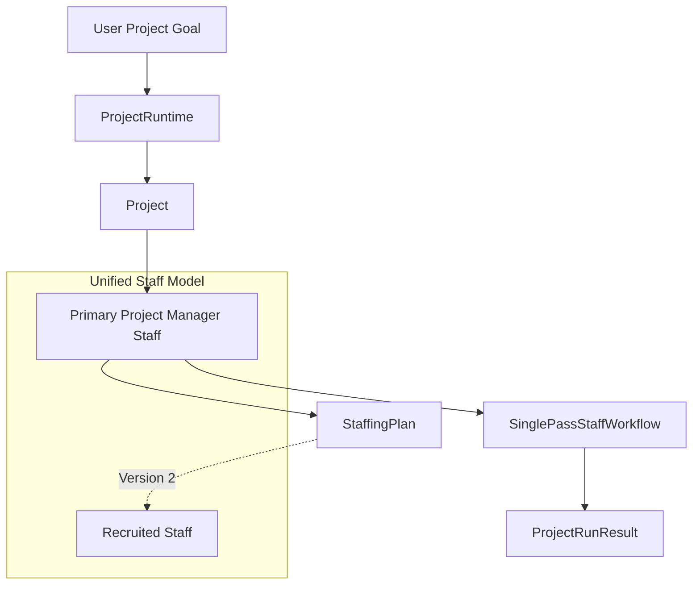
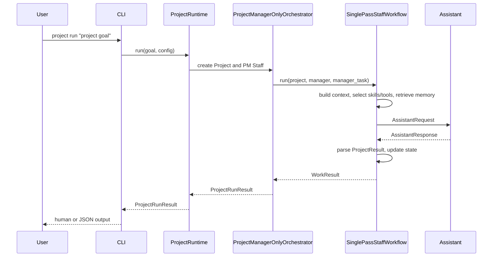
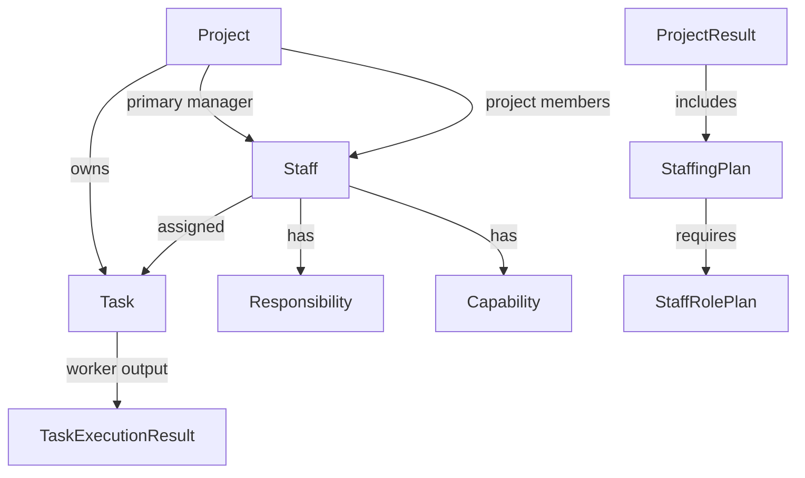
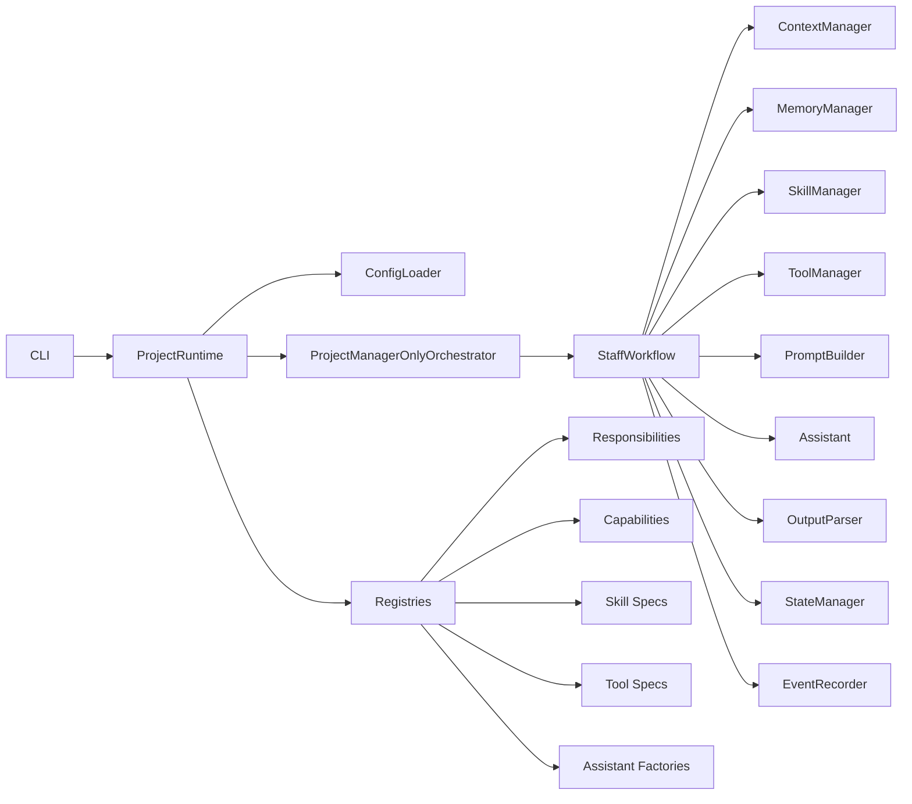
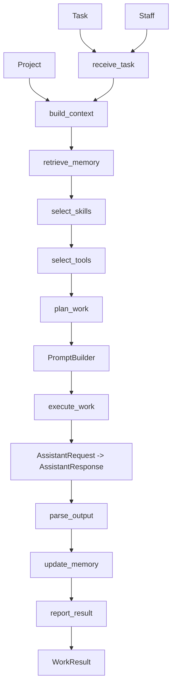
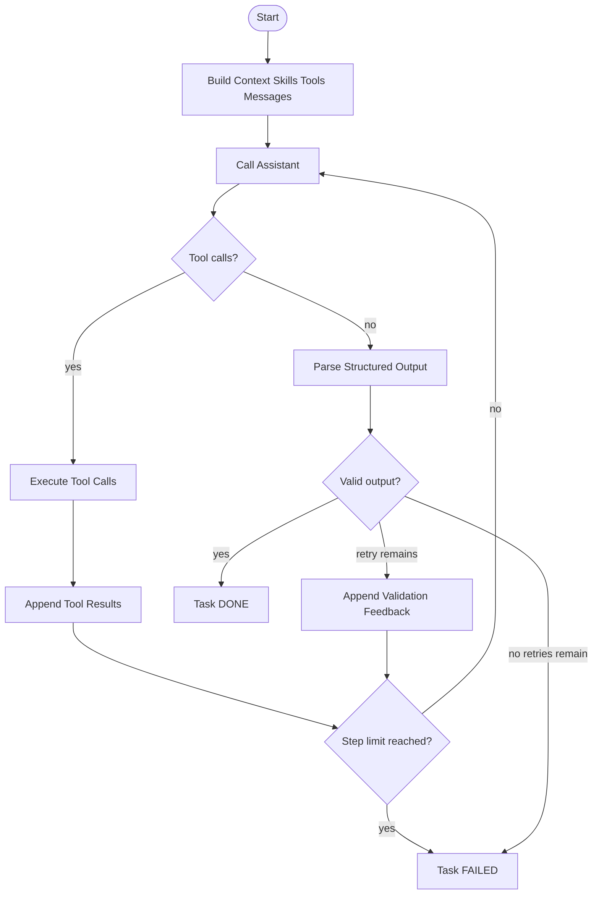
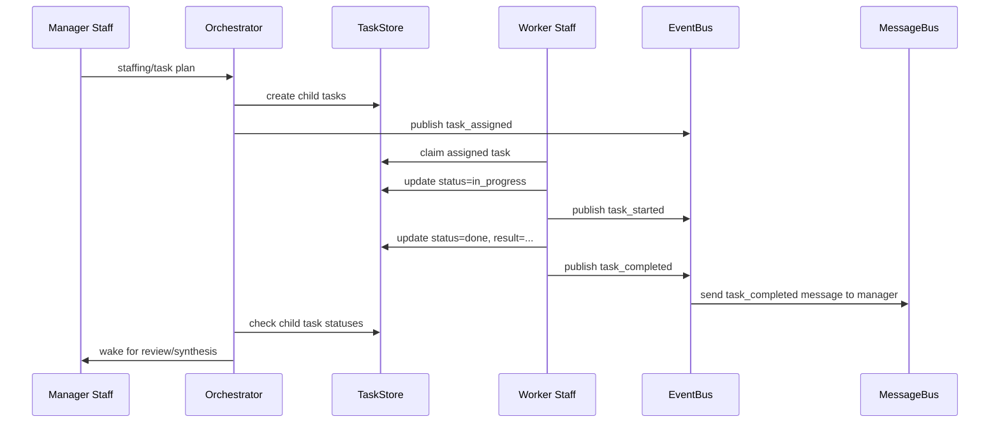
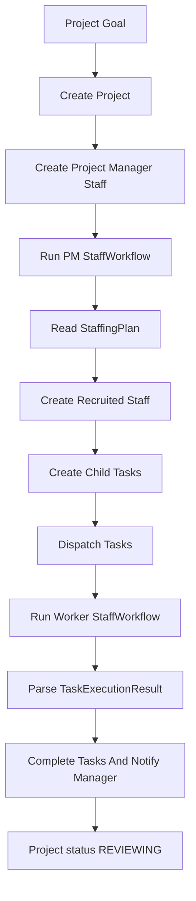
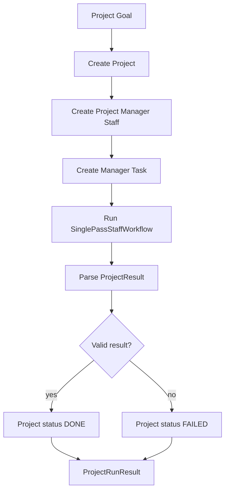
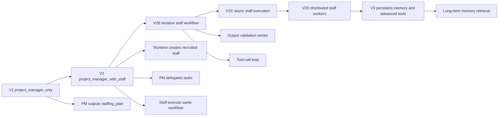

# Project-Oriented Agent Framework Design

## 1. Background

`lego_agent` is being redesigned as a project-oriented agent framework.

The framework input is a project goal. After receiving the goal, the system creates a `Project`. Every project must first create one primary project manager. The project manager is responsible for understanding the goal, planning the work, producing a staffing plan, coordinating execution in later phases, and delivering the final project result.

The previous `Organization` concept is removed. A project may contain a staff graph internally, but `Project` is the only top-level runtime concept.

## 2. Core Principles

1. Project-first
   The system starts from a project goal, not from a prebuilt organization.

2. Project manager is mandatory
   Every project must have exactly one primary project manager.

3. Project manager is also staff
   Project manager is not a special model class. It is a `Staff` configured with project management responsibilities and capabilities.

4. All project members are staff
   Project manager, engineer, reviewer, researcher, tester, and other roles share the same `Staff` data model.

5. Staff workflow is unified
   Every staff member follows the same abstract workflow. Role differences come from responsibilities, capabilities, assistant configuration, assigned tasks, and project context.

6. First version is project-manager-only
   Version 1 does not dynamically create and run recruited staff. The project manager outputs a `staffing_plan`. Dynamic staff creation and multi-staff execution are deferred to Version 2.

7. Runtime behavior should be observable
   Important lifecycle transitions, staff work steps, task state changes, and failures should produce clear logs or structured events. Logs and events must help beginners understand what happened without exposing secrets such as API keys or tokens.

## 2.1 Concept Overview



## 3. Target Runtime Flow

Version 1 runtime:

```text
project goal
  -> create Project
  -> create primary project manager Staff
  -> create project task for manager
  -> project manager analyzes goal
  -> project manager outputs structured ProjectResult
  -> project completes
```

Version 1 output must include:

- project understanding
- assumptions
- risks
- staffing plan
- staffing profile resolution
- task breakdown
- execution plan
- final output

### 3.1 Version 1 Sequence



## 4. Domain Model

### 4.1 Project

`Project` is the top-level runtime aggregate.

```python
class Project(BaseModel):
    id: str
    goal: str
    name: str | None = None
    description: str | None = None

    status: ProjectStatus

    manager_id: str
    staff: dict[str, Staff] = {}
    tasks: dict[str, Task] = {}

    staffing_plan: StaffingPlan | None = None
    result: ProjectResult | None = None
    error: ProjectError | None = None

    created_at: datetime
    updated_at: datetime | None = None
    completed_at: datetime | None = None

    metadata: dict[str, Any] = {}
```

### 4.1.1 Core Entity Relationship



### 4.2 ProjectStatus

```python
class ProjectStatus(StrEnum):
    CREATED = "created"
    PLANNING = "planning"
    STAFFING = "staffing"
    RUNNING = "running"
    REVIEWING = "reviewing"
    DONE = "done"
    FAILED = "failed"
```

Version 1 uses:

- `CREATED`
- `PLANNING`
- `DONE`
- `FAILED`

The other statuses are reserved for later phases.

### 4.3 Staff

`Staff` is the unified project member model.

```python
class Staff(BaseModel):
    id: str
    project_id: str

    name: str
    role: str
    title: str
    description: str | None = None

    responsibilities: list[Responsibility]
    capabilities: list[Capability]
    assistant: Assistant | None = None

    manager_id: str | None = None
    report_ids: list[str] = []

    status: StaffStatus
    current_task_id: str | None = None

    metadata: dict[str, Any] = {}
```

The project manager is represented as:

```python
role = "project_manager"
```

### 4.4 StaffStatus

```python
class StaffStatus(StrEnum):
    IDLE = "idle"
    WORKING = "working"
    BLOCKED = "blocked"
    OFFLINE = "offline"
```

### 4.5 Responsibility

Responsibilities describe what a staff member is accountable for.

Examples:

- requirements analysis
- planning
- staffing
- coordination
- implementation
- review
- testing

```python
class Responsibility(BaseModel):
    name: str
    description: str
```

### 4.6 Capability

Capabilities describe what a staff member can do.

Examples:

- task decomposition
- staff recruitment
- delegation
- code generation
- quality review
- test planning

```python
class Capability(BaseModel):
    name: str
    description: str
```

### 4.7 Task

`Task` represents work assigned to staff.

Version 1 creates one manager task for the project manager.

```python
class Task(BaseModel):
    id: str
    project_id: str

    title: str
    goal: str

    assigned_to: str | None = None
    created_by: str | None = None
    parent_task_id: str | None = None

    status: TaskStatus
    result: str | None = None
    error: TaskError | None = None

    created_at: datetime
    updated_at: datetime | None = None
    started_at: datetime | None = None
    completed_at: datetime | None = None

    metadata: dict[str, Any] = {}
```

### 4.8 StaffingPlan

Version 1 does not execute recruited staff. It only outputs a staffing plan.

```python
class StaffingPlan(BaseModel):
    required_roles: list[StaffRolePlan]
    rationale: str
```

```python
class StaffRolePlan(BaseModel):
    role: str
    title: str
    responsibilities: list[str]
    capabilities: list[str]
    task_focus: str
    priority: int = 1
```

`StaffRolePlan.role` is model-generated text, so it may be a human label such
as `"Frontend Developer"`. When the runtime creates dynamic staff, it normalizes
that role into a stable internal staff id and role such as
`"frontend_developer"`. The original human label is preserved in `title` and in
staff metadata as `planned_role`.

### 4.8.1 StaffProfileResolution

Version 1 does not create recruited staff yet, but it resolves each planned role
so users can see how the future project team would be built. Configured staff
profiles are templates, not a whitelist. If a planned role has no template and
dynamic staff is enabled, the runtime can still create staff directly from the
project manager's `StaffRolePlan`.

```python
class StaffProfileMatch(BaseModel):
    planned_role: str
    planned_title: str
    matched: bool
    source: str = "profile"
    profile_name: str | None = None
    profile_role: str | None = None
    profile_title: str | None = None
    reason: str
```

```python
class StaffProfileResolution(BaseModel):
    matches: list[StaffProfileMatch] = []
```

`source` describes how the role will be created:

- `profile`: use a configured profile as a template.
- `dynamic`: create staff from the AI-generated staffing plan.
- `unresolved`: cannot create staff because dynamic creation is disabled and no profile exists.

### 4.9 ProjectResult

`ProjectResult` is the structured project-level output.

```python
class ProjectResult(BaseModel):
    summary: str
    project_understanding: str
    assumptions: list[str] = []
    risks: list[str] = []
    staffing_plan: StaffingPlan
    task_breakdown: list[str] = []
    execution_plan: list[str] = []
    final_output: str
```

### 4.10 TaskExecutionResult

`TaskExecutionResult` is the structured output produced by non-manager staff for
one assigned task. It keeps worker output separate from the project manager's
project-level `ProjectResult`.

```python
class TaskExecutionResult(BaseModel):
    summary: str
    work_performed: list[str] = []
    deliverables: list[str] = []
    blockers: list[str] = []
    next_steps: list[str] = []
    final_output: str
```

### 4.11 ProjectRunResult

`ProjectRunResult` is returned by CLI/API execution.

```python
class ProjectRunResult(BaseModel):
    run_id: str
    project_id: str
    project_goal: str
    status: ProjectStatus

    manager_id: str
    manager_name: str

    result: ProjectResult | None = None
    staffing_profile_resolution: StaffProfileResolution | None = None
    error: ProjectError | None = None
    events: list[ProjectEvent] = []

    started_at: datetime
    completed_at: datetime | None = None
    duration_ms: int | None = None
```

### 4.12 ProjectEvent and TaskEvent

Events provide lightweight in-memory observability for Version 1.

```python
class ProjectEvent(BaseModel):
    id: str
    project_id: str
    type: str
    message: str
    level: EventLevel
    actor_id: str | None = None
    task_id: str | None = None
    data: dict[str, Any] = {}
    created_at: datetime
```

```python
class TaskEvent(BaseModel):
    id: str
    project_id: str
    task_id: str
    type: str
    message: str
    level: EventLevel
    actor_id: str | None = None
    data: dict[str, Any] = {}
    created_at: datetime
```

The initial `EventRecorder` appends events to the current `Project` and `Task`.
It is not persistent storage.

### 4.12 WorkContext

`WorkContext` is the contextual package used by `StaffWorkflow`.

It should not be stored directly on `Staff`. It is built for each task run.

```python
class WorkContext(BaseModel):
    project_id: str
    task_id: str
    staff_id: str

    project_goal: str
    task_goal: str

    role_context: str | None = None
    task_context: str | None = None
    memory_context: str | None = None
    tool_context: str | None = None
    skill_context: str | None = None

    variables: dict[str, Any] = {}
```

### 4.13 AssistantRequest and AssistantResponse

The assistant interface should use request and response models instead of a narrow `respond(staff, task, context)` signature.

```python
class OutputContract(BaseModel):
    name: str
    json_schema: dict[str, Any]
    instructions: str
```

```python
class AssistantRequest(BaseModel):
    project: Project
    staff: Staff
    task: Task
    context: WorkContext
    messages: list[Message] = []
    output_contract: OutputContract | None = None
    output_schema: dict[str, Any] | None = None
    metadata: dict[str, Any] = {}
```

```python
class AssistantResponse(BaseModel):
    content: str
    tool_calls: list[ToolCall] = []
    finish_reason: str | None = None
    structured: dict[str, Any] = {}
    raw: Any | None = None
    metadata: dict[str, Any] = {}
```

### 4.14 Tools

Tools represent callable external actions.

Examples:

- file read/write
- web search
- database query
- HTTP call
- running tests

```python
class ToolSpec(BaseModel):
    name: str
    description: str
    parameters_schema: dict[str, Any] = {}
```

```python
class ToolCall(BaseModel):
    id: str | None = None
    tool_name: str
    arguments: dict[str, Any] = {}
```

```python
class ToolResult(BaseModel):
    tool_name: str
    success: bool
    content: str | None = None
    error: str | None = None
    data: dict[str, Any] = {}
```

Version 1 defines tool interfaces and a noop implementation. V2B introduces
the workflow loop that can execute model-requested tool calls, append tool
results back to the running message history, and continue until the task
produces valid final output or fails.

### 4.15 Skills

Skills represent reusable work methods, domain procedures, or expert workflows.

Tool and skill are intentionally separate:

```text
Tool = a callable action
Skill = a reusable method or process
```

Examples:

- requirements analysis
- technical design
- project planning
- code review
- test planning

```python
class SkillSpec(BaseModel):
    name: str
    description: str
    instructions: str
    required_capabilities: list[str] = []
    available_tools: list[str] = []
```

Version 1 injects selected skill instructions into prompts. It does not implement nested skill runtimes.

### 4.16 Memory

Memory is divided by scope:

```text
working memory: current task context
project memory: current project history
staff memory: one staff member's reusable experience
global memory: cross-project reusable knowledge
```

```python
class MemoryItem(BaseModel):
    id: str
    scope: str
    content: str
    tags: list[str] = []
    metadata: dict[str, Any] = {}
    created_at: datetime
```

Version 1 defines memory interfaces and uses `NoopMemoryManager` or project events as simple memory. Long-term storage and vector retrieval are out of scope.

## 5. Agent Modules

The framework has these necessary agent modules:

1. State module
   Owns `Project`, `Staff`, `Task`, run state, and events.

2. Config module
   Loads project runtime config and staff profiles.

3. Registry module
   Registers responsibilities, capabilities, assistants, workflows, orchestrators, tools, skills, and output parsers.

4. Assistant module
   Connects to OpenAI-compatible model providers through `AssistantRequest -> AssistantResponse`.

5. Prompt module
   Builds prompts from project, staff, task, context, responsibilities, capabilities, skills, tools, and output contracts.

6. Capability module
   Describes what staff can do. Version 1 treats capabilities as prompt context. Later versions may execute capability functions.

7. Tool module
   Describes and later executes external actions. Version 1 uses noop tool management.

8. Skill module
   Describes and selects reusable work methods. Version 1 injects skill instructions into prompts.

9. Memory module
   Retrieves and stores useful context. Version 1 uses noop memory.

10. Workflow module
    Executes the unified staff workflow.

11. Orchestration module
    Runs project-level orchestration such as `project_manager_only`.

12. Output module
    Parses, validates, and falls back for structured outputs such as `ProjectResult`.

13. Observability module
    Records project and task events for debugging and later persistence.

### 5.1 Module Dependency Graph



## 6. Unified Staff Workflow

All staff share one abstract workflow:

```text
receive_task
  -> build_context
  -> retrieve_memory
  -> select_skills
  -> select_tools
  -> plan_work
  -> execute_work
  -> parse_output
  -> update_memory
  -> report_result
```

Version 1 used this workflow only for the project manager. V2A also uses it
for recruited staff, with a different output contract for worker tasks.

The project manager task is:

```text
Analyze the project goal, define assumptions and risks, create a staffing plan,
break down work, propose an execution plan, and produce an initial project result.
```

The workflow should be implemented with explicit hooks:

```python
class StaffWorkflow:
    def receive_task(...): ...
    def build_context(...): ...
    def retrieve_memory(...): ...
    def select_skills(...): ...
    def select_tools(...): ...
    def plan_work(...): ...
    def execute_work(...): ...
    def parse_output(...): ...
    def update_memory(...): ...
    def report_result(...): ...
```

Current implemented workflow components:

- `SinglePassStaffWorkflow`
- `DefaultContextManager`
- `NoopMemoryManager`
- `NoopToolManager`
- `NoopSkillManager`
- `DefaultPromptBuilder`
- `ProjectResultOutputParser`
- `TaskExecutionResultOutputParser`

The project manager should not use a separate workflow class. It uses the same workflow with a project-manager output contract.

For realistic tasks, `SinglePassStaffWorkflow` is not enough. It is retained as
the simple baseline, while V2B should add `IterativeStaffWorkflow` with the same
public `run(project, staff, task) -> WorkResult` shape. Orchestrators should
depend on the workflow interface, not on whether the workflow is single-pass or
iterative.

```python
class WorkflowConfig(BaseModel):
    type: str = "single_pass"
    max_steps: int = 8
    max_tool_calls: int = 5
    max_output_retries: int = 2
    fail_on_tool_error: bool = True
```

### 6.1 StaffWorkflow State Flow


### 6.2 Workflow Collaboration



### 6.3 Iterative Staff Workflow

`IterativeStaffWorkflow` is the target workflow for real agent execution. One
task may require multiple assistant calls, tool calls, output validation
feedback, and retries before it can be completed.

```text
receive_task
  -> build_context
  -> retrieve_memory
  -> select_skills
  -> select_tools
  -> build initial messages
  -> while step_count < max_steps:
       execute_work
       if assistant returned tool_calls:
         execute_tool_calls
         append tool results to messages
         continue
       parse_output
       if output is valid:
         update_memory
         report_result
         break
       if output is invalid and retries remain:
         append validation feedback to messages
         continue
       fail task
```



V2B should first implement multi-step output validation retries without real
tool execution. The second increment should add the tool-call loop. This keeps
the workflow change reviewable and avoids changing assistant parsing, tool
execution, and output validation all at once.

Intermediate task progress should be represented by events before expanding
`TaskStatus`. Initial V2B events should include:

- `workflow_step_started`
- `workflow_step_completed`
- `tool_call_requested`
- `tool_call_completed`
- `tool_call_failed`
- `output_validation_failed`
- `workflow_step_limit_reached`

`TaskStatus` can remain `pending`, `in_progress`, `done`, and `failed` until a
UI/API needs stronger states such as `waiting_tool`, `waiting_manager`, or
`blocked`.

## 7. Context, Tools, Skills, and Memory Interfaces

### 7.1 ContextManager

```python
class ContextManager:
    def build_context(
        self,
        project: Project,
        staff: Staff,
        task: Task,
    ) -> WorkContext:
        ...
```

Version 1 context includes project goal, task goal, staff responsibilities, and staff capabilities.

### 7.2 ToolManager

```python
class ToolManager:
    def list_tools(self, staff: Staff, task: Task) -> list[ToolSpec]:
        ...

    def call_tool(self, call: ToolCall) -> ToolResult:
        ...
```

Version 1 implements `NoopToolManager`. It may list configured tool specs, but does not execute assistant-requested tool calls.

Built-in tool implementation should follow the same practical shape as Codex
tools:

- each tool has a small explicit schema, a narrow responsibility, and stable
  input/output contracts;
- tool execution is mediated by `ToolManager`, never called directly from staff
  or assistant adapters;
- tools return structured `ToolResult` objects instead of raising raw provider
  or operating-system details into workflow code;
- tools must be observable through events and logs;
- tools must avoid leaking secrets in logs or model-visible output;
- tools that can read or change local state must enforce workspace boundaries
  and clear safety rules.

This keeps tools composable while still allowing future adapters for file,
shell, web, search, or external API actions.

The current V2B-2 `BuiltinToolManager` may contain the first built-in tools
directly as a minimal implementation. That should not become the long-term
extension model. The next tool architecture should introduce a registry and
independent tool classes:

```python
class Tool(Protocol):
    name: str
    description: str
    parameters_schema: dict[str, Any]

    def call(self, arguments: dict[str, Any]) -> ToolResult:
        ...
```

```python
class ToolRegistry:
    def register(self, tool: Tool) -> None: ...
    def get(self, name: str) -> Tool: ...
    def list(self) -> list[Tool]: ...
```

Target responsibilities:

- `ToolRegistry` owns tool lookup and registration.
- `BuiltinToolManager` owns enabled-tool checks, logging, error handling, and
  delegation to registered tools.
- Concrete tools such as `EchoTool` and `ReadProjectFileTool` own their own
  schema and execution logic.
- Adding a new built-in tool should not require editing `BuiltinToolManager`.

This preserves SOLID boundaries while keeping the external `ToolManager`
contract stable for workflows.

### 7.3 SkillManager

```python
class SkillManager:
    def list_skills(self, staff: Staff, task: Task) -> list[SkillSpec]:
        ...

    def select_skills(
        self,
        staff: Staff,
        task: Task,
        context: WorkContext,
    ) -> list[SkillSpec]:
        ...
```

Version 1 implements `NoopSkillManager` or a simple configured-skill selector.

Built-in skill implementation should also borrow from the Codex model, but at a
higher abstraction level. A skill should be a reusable work method rather than a
direct action. In early versions, skills remain prompt instructions selected by
`SkillManager`. When V3 adds skill runtime, a skill may bundle:

- instructions and examples;
- required capabilities;
- allowed tools;
- validation rules;
- optional workflow policy such as max steps or retry behavior.

Tools are callable actions. Skills are reusable procedures that guide how a
staff member uses context, tools, and output contracts.

### 7.4 MemoryManager

```python
class MemoryManager:
    def retrieve(
        self,
        project: Project,
        staff: Staff,
        task: Task,
        query: str,
    ) -> list[MemoryItem]:
        ...

    def remember(
        self,
        project: Project,
        staff: Staff,
        item: MemoryItem,
    ) -> None:
        ...
```

Version 1 implements `NoopMemoryManager`.

## 8. Assistant Configuration

Assistant configuration stays OpenAI-compatible.

```json
{
  "type": "openai",
  "model": "deepseek-v4-pro",
  "api_key": "sk-...",
  "base_url": "https://api.deepseek.com",
  "timeout_seconds": 30,
  "thinking": {
    "type": "enabled"
  },
  "reasoning_effort": "high",
  "token_limit": 4096
}
```

Supported token limit aliases:

- `token_limit`
- `tokenlimit`
- `max_output_tokens`

`OPENAI_API_KEY` and `OPENAI_BASE_URL` may be used for environment-based configuration.

## 9. Runtime Configuration

The new configuration should be project runtime oriented.

```json
{
  "project": {
    "default_manager_profile": "project_manager"
  },
  "orchestration": {
    "strategy": "project_manager_only"
  },
  "dynamic_staff": {
    "enabled": true,
    "default_assistant": {
      "type": "openai",
      "model": "deepseek-v4-pro",
      "base_url": "https://api.deepseek.com",
      "timeout_seconds": 120,
      "stream": false,
      "response_format": {
        "type": "json_object"
      },
      "thinking": {
        "type": "disabled"
      },
      "token_limit": 4096
    },
    "allow_dynamic_responsibilities": true,
    "allow_dynamic_capabilities": true
  },
  "staff_profiles": {
    "project_manager": {
      "name": "Ava",
      "role": "project_manager",
      "title": "Project Manager",
      "responsibilities": [
        "requirements_analysis",
        "planning",
        "staffing",
        "coordination",
        "acceptance"
      ],
      "capabilities": [
        "task_decomposition",
        "staff_recruitment",
        "delegation",
        "quality_review"
      ],
      "assistant": {
        "type": "openai",
        "model": "deepseek-v4-pro",
        "base_url": "https://api.deepseek.com",
        "timeout_seconds": 120,
        "stream": false,
        "response_format": {
          "type": "json_object"
        },
        "thinking": {
          "type": "disabled"
        },
        "token_limit": 4096
      }
    }
  },
  "modules": []
}
```

Only the project manager must be configured up front. Other profiles are
optional templates. If the project manager plans a role that has no configured
template, `dynamic_staff` controls whether the runtime may create that staff
from the plan.

## 10. CLI Design

Target CLI:

```bash
lego-agent project run --config configs/project_runtime.json "Build a configurable agent framework"
```

JSON output:

```bash
lego-agent project run --config configs/project_runtime.json --json "Build a configurable agent framework"
```

The old organization CLI and configuration should be removed during the rewrite.

For the detailed runtime call chain from CLI entry to `ProjectRunResult`, see
[CLI Call Flow](CLI_CALL_FLOW.md).

## 11. Orchestration

Version 1 supports exactly one orchestration strategy:

```text
project_manager_only
```

The orchestrator must:

1. create a project
2. create the manager staff from the configured manager profile
3. create the manager task
4. run the project manager staff workflow
5. parse or construct `ProjectResult`
6. complete or fail the project
7. return `ProjectRunResult`

## 11.1 Staff Interaction Model

Version 2 should not make staff call each other directly. Staff interaction
should happen through project state, events, messages, and orchestration.

Core rule:

```text
Staff do not directly invoke other Staff.
Staff create/update Tasks, publish Events, and send Messages.
The Orchestrator decides what runs next.
```

### 11.1.1 Interaction Layers

```text
Task State: the source of truth
Event Log: what happened
Inbox Message: who should be notified
```

Example:

```text
Staff completes task
  -> Task.status = done
  -> Task.result = ...
  -> publish task_completed event
  -> send task_completed message to manager inbox
```

Manager awareness should come from:

1. `TaskStore` queries for reliable state.
2. `StaffMessage` inbox entries for notifications.
3. Project/task events for audit and debugging.
4. Staff status as supporting information.

### 11.1.2 Interaction Models

```python
class StaffMessage(BaseModel):
    id: str
    project_id: str
    sender_id: str
    recipient_id: str
    type: str
    task_id: str | None = None
    content: str
    data: dict[str, Any] = {}
    created_at: datetime
    read_at: datetime | None = None
```

```python
class StaffInbox(BaseModel):
    staff_id: str
    project_id: str
    messages: list[StaffMessage] = []
```

These models are implemented in `lego_agent.core.models`.

### 11.1.3 Interaction Interfaces and In-Memory Implementations

```python
class TaskStore(Protocol):
    def create(self, task: Task) -> Task: ...
    def update(self, task: Task) -> Task: ...
    def get(self, task_id: str) -> Task: ...
    def children_of(self, parent_task_id: str) -> list[Task]: ...
```

```python
class MessageBus(Protocol):
    def send(self, message: StaffMessage) -> StaffMessage: ...
    def inbox_for(self, staff_id: str, project_id: str) -> list[StaffMessage]: ...
    def unread_for(self, staff_id: str, project_id: str) -> list[StaffMessage]: ...
    def mark_read(self, message_id: str) -> StaffMessage: ...
```

Version 2A starts with:

- `InMemoryTaskStore`
- `InMemoryMessageBus`

They are implemented in `lego_agent.project.interaction`. The stores keep the
same boundary that later SQLite/Postgres/Redis implementations should provide.

### 11.1.4 Coordination Helpers

```python
class TaskDispatcher:
    def assign(
        self,
        project: Project,
        task: Task,
        assignee: Staff,
        created_by: Staff,
    ) -> Task:
        ...
```

```python
class TaskCompletionHandler:
    def complete(
        self,
        project: Project,
        task: Task,
        staff: Staff,
        result: WorkResult,
    ) -> Task:
        ...
```

These helpers are implemented in `lego_agent.project.interaction`.

### 11.1.5 Manager Notification Flow



### 11.1.6 Implementation Strategy

Do not start with distributed async execution.

Version 2 should progress in four steps:

1. Synchronous multi-staff with event/message semantics.
   - Create recruited staff.
   - Create child tasks.
   - Execute staff tasks one by one.
   - Emit events and manager messages.
   - Manager reviews after all child tasks complete.

2. Iterative staff workflow.
   - Keep the same workflow interface.
   - Add configurable `max_steps`, output retries, and tool-call limits.
   - Start with output validation retries.
   - Add real tool-call loops after assistant/tool response contracts are stable.

3. `asyncio` concurrent staff tasks.
   - Use the same stores and buses.
   - Replace sequential execution with concurrent task execution.

4. Distributed execution.
   - Replace in-memory stores/buses with Redis, database-backed queues, or workers.

The source of truth remains task state. Events and messages are notifications,
not the final authority.

### 11.2 Project Manager With Staff Execution

`project_manager_with_staff` starts Version 2A with synchronous worker
execution. It still does not perform manager final review; when child tasks
finish successfully, the project moves to `reviewing`.

Current behavior:

1. Create project and primary project manager.
2. Run the project manager through `SinglePassStaffWorkflow`.
3. Read `ProjectResult.staffing_plan`.
4. Create recruited staff through `StaffFactory`.
5. Create one child task for each recruited staff role.
6. Assign child tasks through `TaskDispatcher`.
7. Execute each child task through `SinglePassStaffWorkflow`.
8. Parse worker output as `TaskExecutionResult`.
9. Complete each task through `TaskCompletionHandler`.
10. Stop with project status `reviewing`.



### 11.3 Project Manager Only Orchestration



### 11.4 Version Evolution



## 12. Version 1 Acceptance Criteria

Version 1 is complete when:

1. `Organization` is removed from public and internal runtime code.
2. `Project` is the only top-level runtime aggregate.
3. Every project creates exactly one primary project manager staff.
4. `project_manager_only` mode runs from CLI.
5. Dry-run mode returns a valid `ProjectRunResult`.
6. Real OpenAI-compatible assistant calls are supported.
7. The project manager output includes a valid `staffing_plan`.
8. Staff workflow has explicit hooks for context, memory, skills, tools, planning, execution, output parsing, and reporting.
9. Version 1 includes default/noop managers for context, memory, skills, and tools.
10. pytest covers model validation, config parsing, CLI, dry-run execution, workflow hooks, and error cases.
