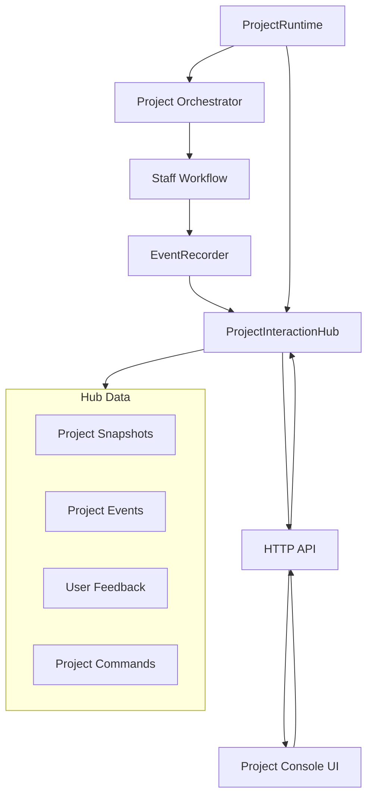
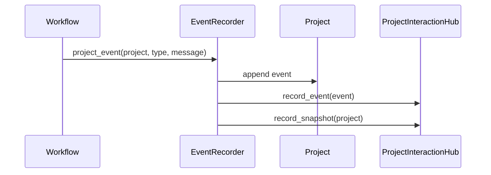

# Project Console and Interaction Hub Design

## 1. Purpose

The current agent runtime can create a project, run the project manager, recruit
staff, assign tasks, execute staff workflows, and record events. The missing
piece is user visibility and user intervention.

This document designs a minimal front-end interaction layer without forcing the
core runtime, orchestrators, or workflows to know about any specific UI.

The goal is:

```text
Agent runtime remains responsible for execution.
Project Console remains responsible for display and user input.
ProjectInteractionHub sits between them as the data exchange layer.
```

## 2. Design Principles

1. Minimal intrusion
   - Do not rewrite orchestrators for the first console version.
   - Do not make workflows depend on FastAPI, browser APIs, or UI concepts.
   - Prefer adding an event/snapshot sink over changing execution logic.

2. Runtime-first source of truth
   - `Project`, `Task`, `Staff`, and events remain runtime-owned models.
   - The console reads snapshots and events; it does not mutate runtime objects directly.

3. Hub as the boundary
   - Frontend and API talk to `ProjectInteractionHub`.
   - Runtime records events and snapshots into `ProjectInteractionHub`.
   - Commands and feedback are stored in the hub first; runtime consumption can be added later.

4. Observable before controllable
   - First version should show what the agent is doing.
   - User intervention can start as stored feedback/commands before it affects running workflows.

5. Local-first
   - Start with an in-memory hub and a local web console.
   - Add persistence only after the data contract stabilizes.

## 3. Architecture



## 4. ProjectInteractionHub

`ProjectInteractionHub` is a middle data layer. It should not contain agent
planning logic or UI rendering logic.

### 4.1 Core Models

```python
class ProjectSnapshot(BaseModel):
    project_id: str
    status: ProjectStatus
    goal: str
    manager_id: str
    staff: dict[str, Staff] = {}
    tasks: dict[str, Task] = {}
    updated_at: datetime
```

```python
class UserFeedback(BaseModel):
    id: str
    project_id: str
    content: str
    target_task_id: str | None = None
    target_staff_id: str | None = None
    created_at: datetime
```

```python
class ProjectCommand(BaseModel):
    id: str
    project_id: str
    type: str
    content: str | None = None
    data: dict[str, Any] = {}
    status: str = "pending"
    created_at: datetime
    handled_at: datetime | None = None
```

Suggested command types:

- `add_user_feedback`
- `pause_project`
- `resume_project`
- `approve_staffing_plan`
- `reject_staffing_plan`
- `retry_task`
- `cancel_task`
- `ask_manager_to_replan`

V1 of the console should store commands but does not need to make runtime
consume every command.

### 4.2 Hub Interface

```python
class ProjectInteractionHub(Protocol):
    def record_event(self, event: ProjectEvent) -> None: ...
    def record_snapshot(self, project: Project) -> None: ...

    def events_for(self, project_id: str) -> list[ProjectEvent]: ...
    def snapshot_for(self, project_id: str) -> ProjectSnapshot | None: ...

    def add_feedback(self, feedback: UserFeedback) -> UserFeedback: ...
    def feedback_for(self, project_id: str) -> list[UserFeedback]: ...

    def add_command(self, command: ProjectCommand) -> ProjectCommand: ...
    def pending_commands(self, project_id: str) -> list[ProjectCommand]: ...
    def mark_command_handled(self, command_id: str) -> None: ...
```

### 4.3 First Implementation

First implementation:

```text
InMemoryProjectInteractionHub
```

Responsibilities:

- keep latest project snapshot per project;
- keep project events in insertion order;
- store user feedback;
- store project commands;
- provide simple query methods for an API layer.

No database is required in the first version.

## 5. Runtime Integration

The lowest-intrusion integration point is `EventRecorder`.



Proposed change:

```python
class EventRecorder:
    def __init__(self, event_sink: ProjectInteractionHub | None = None):
        self.event_sink = event_sink
```

When `event_sink` is omitted, current behavior remains unchanged.

## 6. Web Console

The first console should be a local operational screen, not a marketing page.
It should prioritize dense, readable project state.

### 6.1 First Screen Layout

```text
------------------------------------------------------------
Header: Project name/goal, status, run controls
------------------------------------------------------------
Left: Staff list                  Center: Task board
- PM                              - Pending
- Frontend Developer              - In Progress
- Tester                          - Done
                                  - Failed
------------------------------------------------------------
Bottom/Right: Event stream and feedback panel
- workflow_started
- staff_created
- task_assigned
- output_validation_failed
- task_completed

Feedback input:
[target task/staff] [message] [Send]
------------------------------------------------------------
```

### 6.2 User Can See

- project status;
- project goal;
- staff list and each staff status;
- task list grouped by status;
- current task assignee;
- task result or error;
- event stream;
- latest user feedback and commands.

### 6.3 User Can Do

First version:

- submit a project goal;
- view events;
- view staff and tasks;
- add feedback;
- add commands that are stored but not necessarily consumed.

Later versions:

- approve or reject staffing plan;
- pause and resume project;
- retry failed task;
- ask PM to replan;
- answer a `waiting_manager` question.

## 7. HTTP API

First API surface:

```text
POST /projects
GET  /projects
GET  /projects/{project_id}
GET  /projects/{project_id}/events
GET  /projects/{project_id}/staff
GET  /projects/{project_id}/tasks
POST /projects/{project_id}/feedback
GET  /projects/{project_id}/feedback
POST /projects/{project_id}/commands
GET  /projects/{project_id}/commands
```

First implementation can use polling. Server-Sent Events can be added after the
polling UI is stable.

## 8. Frontend Technology

Start simple:

```text
FastAPI + static HTML/CSS/JavaScript
```

Reasons:

- minimal package and build complexity;
- easy to run locally;
- enough for polling API and project state display;
- avoids introducing a full frontend build system before API contracts stabilize.

Potential later stack:

```text
FastAPI + React/Vite
```

Only move to this when the console needs richer editing, task board behavior,
or multiple long-lived sessions.

## 9. Development Plan

### Phase C1: Interaction Hub

Status: pending.

Tasks:

1. Add `lego_agent/project/interaction_hub.py`.
2. Add `ProjectSnapshot`.
3. Add `UserFeedback`.
4. Add `ProjectCommand`.
5. Add `ProjectInteractionHub` protocol.
6. Add `InMemoryProjectInteractionHub`.
7. Add tests for:
   - recording events;
   - recording snapshots;
   - storing feedback;
   - storing commands;
   - marking commands handled.

Acceptance:

- hub can store and return project events, snapshots, feedback, and commands;
- no runtime behavior changes when no hub is provided.

### Phase C2: EventRecorder Sink

Status: pending.

Tasks:

1. Add optional `event_sink` to `EventRecorder`.
2. On project events, call:
   - `record_event(event)`
   - `record_snapshot(project)`
3. Keep current `project.events` behavior unchanged.
4. Add tests that `EventRecorder` pushes data into the hub.

Acceptance:

- existing runtime tests still pass;
- hub receives events and snapshots during a run;
- no UI dependency is introduced into runtime modules.

### Phase C3: Local HTTP API

Status: pending.

Tasks:

1. Add `lego_agent/server/app.py`.
2. Add an in-memory server store for project sessions.
3. Add `POST /projects` to start a project run.
4. Add query endpoints for snapshots, events, staff, tasks, feedback, and commands.
5. Run project execution in a background thread so polling can observe progress.

Acceptance:

- user can start a project from HTTP;
- user can poll events while or after the project runs;
- API returns JSON shaped by Pydantic models.

### Phase C4: Static Web Console

Status: pending.

Tasks:

1. Add a static `index.html`.
2. Add project goal input.
3. Add project status panel.
4. Add staff panel.
5. Add task board.
6. Add event stream.
7. Add feedback input.
8. Poll API endpoints on an interval.

Acceptance:

- user can start a project from the browser;
- user can see staff, tasks, and events;
- user can submit feedback;
- no core workflow logic is duplicated in frontend code.

### Phase C5: Runtime Command Consumption

Status: future.

Tasks:

1. Let iterative workflow check pending feedback between steps.
2. Add `waiting_manager` semantics only when needed.
3. Support selected commands:
   - retry task;
   - ask PM to replan;
   - approve staffing plan.

Acceptance:

- user feedback can affect a running or next-step workflow;
- command handling is explicit and evented;
- unsupported commands remain stored but harmless.

## 10. Non-Goals For First Version

Do not implement these in the first console version:

- database persistence;
- authentication;
- multi-user collaboration;
- WebSocket;
- complex React/Vite build;
- runtime pause/resume;
- arbitrary frontend mutation of `Project`;
- direct frontend calls into workflow classes.

